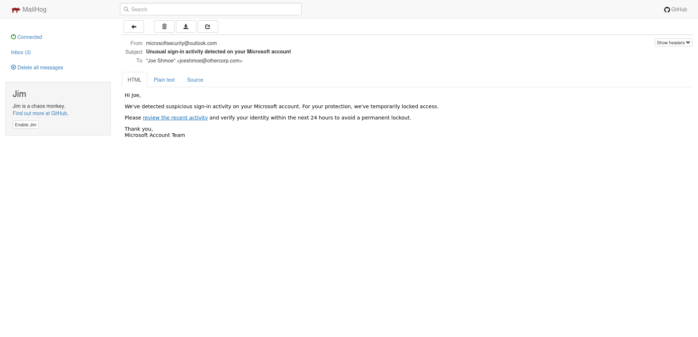
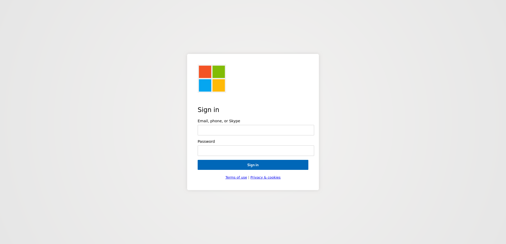
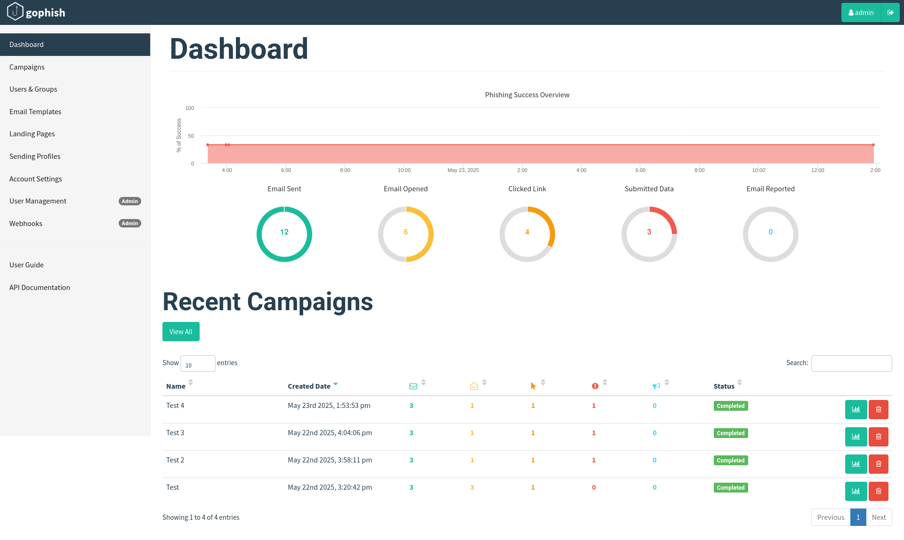

# 🎯 Phish Email Lab (Red Team Simulation Project)

This is a self-contained phishing simulation lab for red team exercises, security awareness training, and ethical testing. It uses [GoPhish](https://getgophish.com/) and [MailHog](https://github.com/mailhog/MailHog) along with custom-built phishing email and landing page templates.

## 🧰 Features

* 🔐 Realistic phishing email templates (Microsoft alerts, invoices, survey lures)
* 🛬 Fake login pages that simulate credential capture
* 📬 MailHog for safe, local email testing
* 🗂️ Social engineering pretexts and writeups
* 🛠️ Full step-by-step GoPhish and MailHog setup guide

> ⚠️ **Ethical Use Only**
> This lab is for authorized use only — such as internal red team testing, phishing awareness training, or CTF-style simulations. Never use it on real users without full permission.

## 📁 Project Structure

| Folder           | Description                                      |
| ---------------- | ------------------------------------------------ |
| `templates/`     | Custom phishing email HTML templates             |
| `landing-pages/` | Fake login pages (Microsoft-themed, etc.)        |
| `pretexts/`      | Markdown files describing each phishing scenario |
| `gophish-setup/` | Install and usage guides for GoPhish and MailHog |

## 🚀 Quick Start

1. Clone this repo and follow the [install guide](gophish-setup/install-guide.md).
2. Launch GoPhish and MailHog on your system.
3. Import email templates and landing pages into GoPhish.
4. Create a fake user group and campaign.
5. Monitor clicks and credential captures (all local and safe).

## 🖼️ Screenshots

### 📬 Phishing Email in MailHog

### 🧑‍💻 Fake Microsoft Login Page

### 📊 GoPhish Dashboard

## 🙌 Attribution

This lab uses the following open-source tools:

* [GoPhish](https://getgophish.com/)
* [MailHog](https://github.com/mailhog/MailHog)

Templates and landing pages were created by Lucas Thompson for simulation and educational purposes.

## 🪪 License

MIT License (see `LICENSE` file). This lab is not to be used for malicious purposes.
